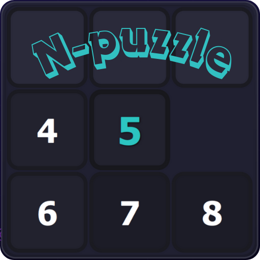
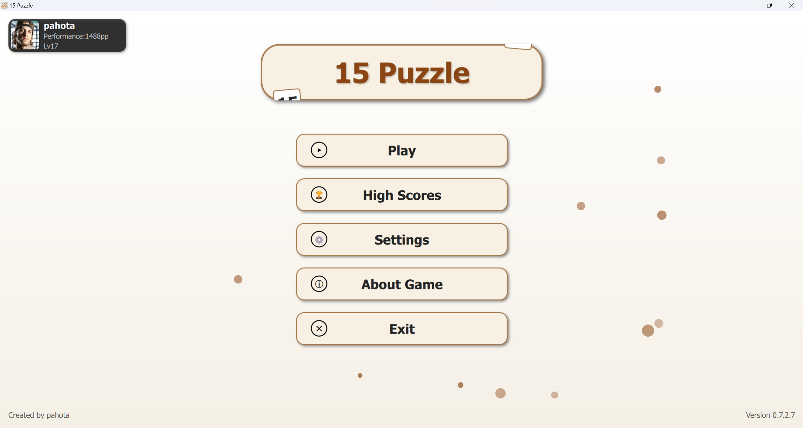
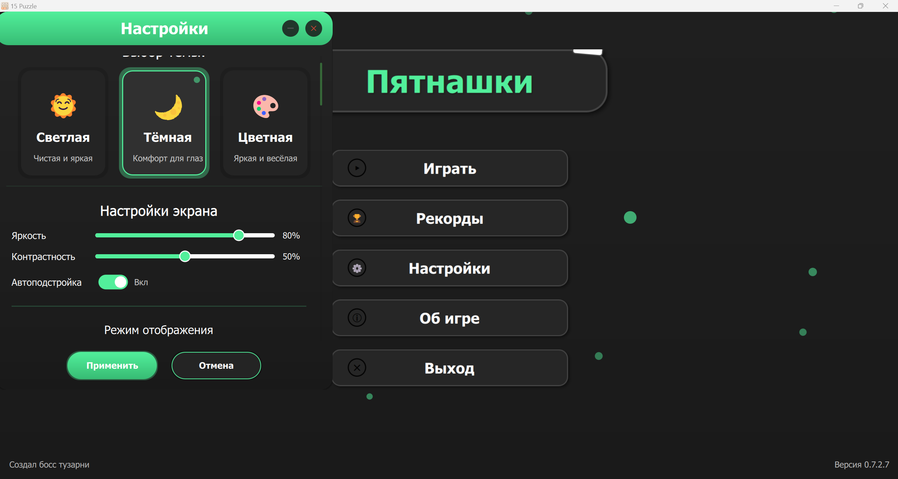
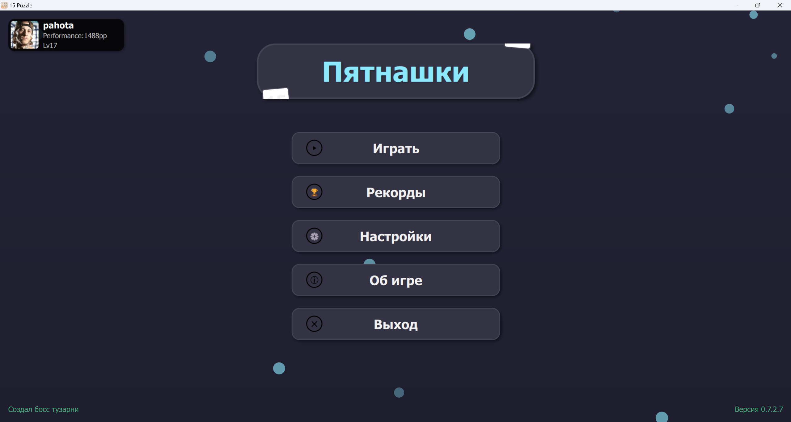

# N-Puzzles

  

  <b>An elegant, modern implementation of the classic sliding puzzle game for desktop platforms</b>

  Built with Qt Quick (QML) and C++ to deliver the ultimate sliding puzzle experience

## 🎮 Project Goal

N-Puzzles reimagines the classic "15 puzzle" with modern design principles and engaging features. Our focus is on creating the most visually appealing and smoothly animated sliding puzzle game available for desktop, with competitive gameplay elements that encourage friendly competition.

## ✨ Features

### Core Gameplay
* 🎲 Multiple difficulty levels (3×3 to 6×6 grids)
* 🎯 Intuitive drag-and-drop controls
* 🔄 Game control buttons (restart, pause)
* ⏱️ Move counter and timer display
* 🏆 Basic scoring system

### Enhanced Experience
* 🎨 Visually appealing modern interface
* 🌓 Three beautiful themes (Light, Dark, Colorful)
* 🔊 Sound effects and background music
* 🌐 Dual-language support (English/Russian)
* ✨ Smooth animations and transitions

## 📸 Screenshots

  
  
  

  
  
  

## 🚀 Getting Started

### Prerequisites
* Qt 6.0 or higher
* CMake 3.14+
* C++17 compatible compiler

### Installation

#### Windows
1. Download the latest release from the Releases page
2. Extract the archive to your preferred location
3. Run `N-Puzzles.exe`

## 🛣️ Roadmap
* 🏆 Enhanced scoring system with global leaderboards
* 👤 User profiles and authentication
* 🎮 Additional gameplay modes
* 🎨 More customization options
* 🔧 Performance optimizations

## 🚧 Known Issues

### Current limitations (to be fixed in release 1.0):
* **Audio settings**: The sound settings system works incorrectly, with possible issues in volume adjustment and enabling/disabling sound effects
* **Display settings**: Some UI elements may not scale correctly on certain displays
* **Authorization system**: The current implementation of the user authorization system is not fully functional and requires further development
* **Scoring system**: The scoring system needs enhancement for better competitive experience
* Occasional audio glitches in the sound effects
* Settings may not always save correctly between sessions

We're actively working on resolving these issues in upcoming releases!

## 📝 License
This project is licensed under the MIT License - see the LICENSE file for details.

## 📬 Contact
* Telegram: [@pahota_0](https://t.me/pahota_0)
* Email: pyakhota1@gmail.com

  <b>Created with ❤️ by beginner Qt desktop developer pahota from SmaktaTeam</b>

