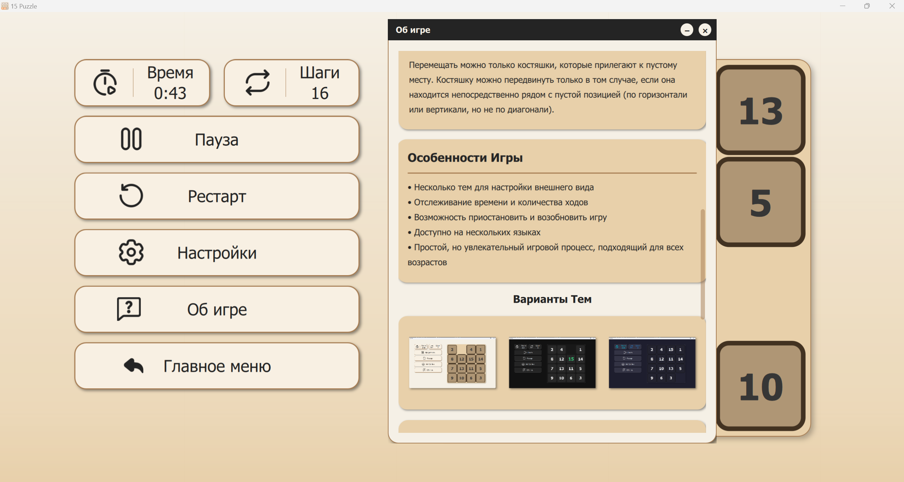
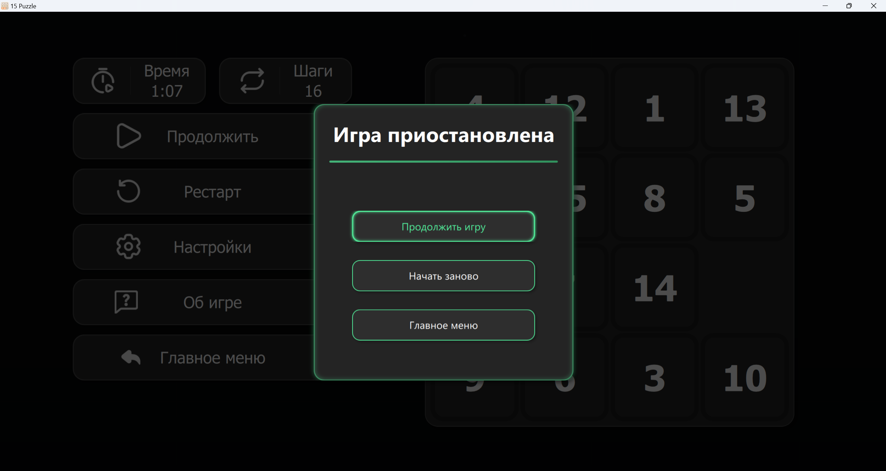
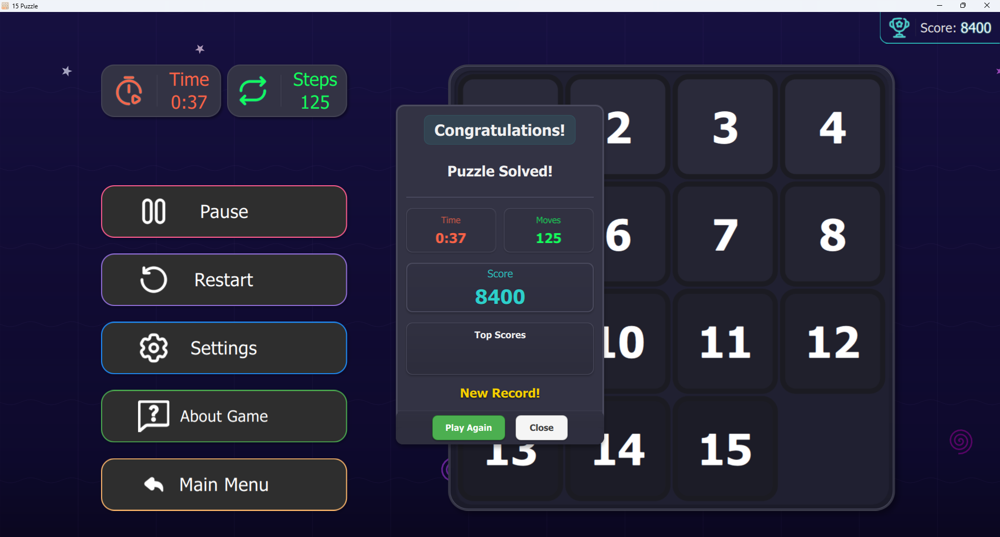

# N-Puzzles

**N-Puzzles** is a stylish and feature-rich implementation of the classic "15 Puzzle" game, developed using **Qt Quick (QML) and C++**.

---

## 🚀 Latest Version: **0.7.2.7**

**Developer:** [pahota](https://t.me/pahota_0) from **SmaktaTeam**

---

## 🎮 Features

✔ **Dual-language interface** (Russian 🇷🇺 / English 🇬🇧)  
✔ **Three UI themes** (Light, Dark, Colorful)  
✔ **Intuitive UI** with smooth animations  
✔ **Interactive settings** for full customization  

---

## 📸 Screenshots

  
  
  

---

## 🔮 Upcoming Updates

🔹 **Scoring system** (player rankings, records)  
🔹 **User authentication** (account login)  
🔹 **More customization options**  
🔹 **Bug fixes and optimizations**  
🔹 **Additional UI themes**  

---

## 📥 Installation

### 🖥 Running on Windows
1. Download the latest version from the [Releases section](https://github.com/SmaktaTeam/N-Puzzles/releases)
2. Extract the archive
3. Run **N-Puzzles**

### 🛠 Building from Source
#### Requirements:
- **Qt 6+**
- **CMake**
- **C++ Compiler**

---

## 🛠 Technologies Used

- **Qt Quick (QML) + C++**
- **CMake** for building

---

## 📜 License
This project is licensed under the **MIT License**.

---

## 💬 Feedback & Contact

📢 **Get in touch with the developer:**  
- Telegram: [pahota_0](https://t.me/pahota_0)  
- GitHub Issues: [Create an issue](https://github.com/pahota/N-Puzzles/issues)  

