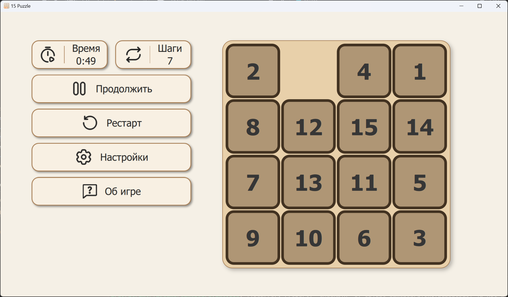
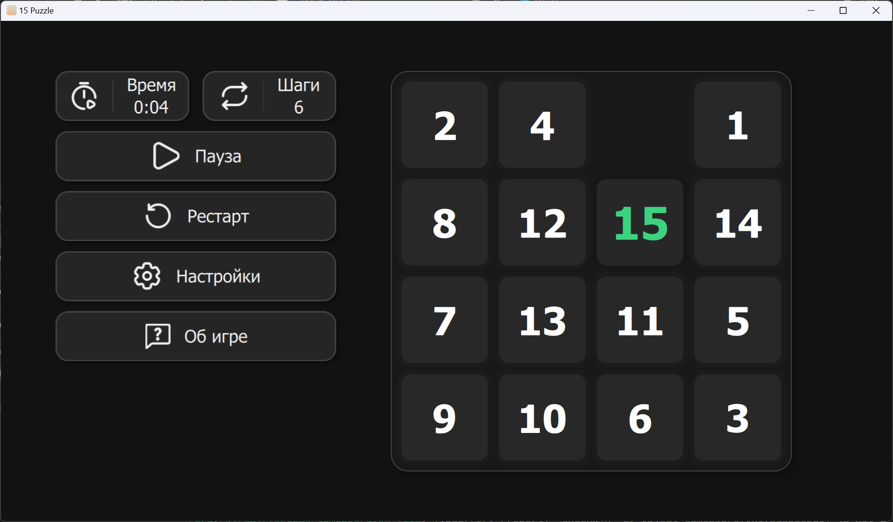
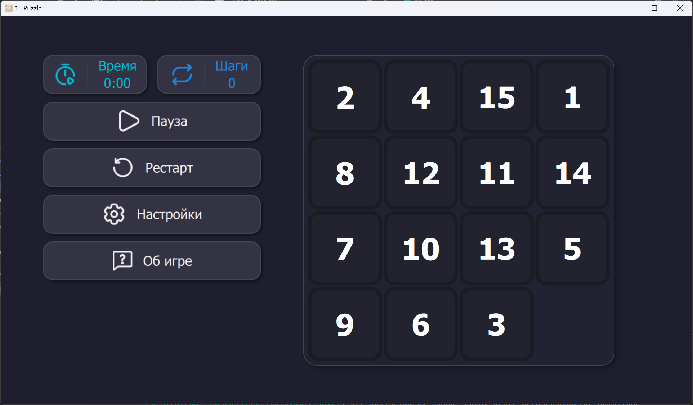

# N-Puzzles


**N-Puzzles** — стильная и функциональная реализация классической игры «Пятнашки», созданная с использованием **Qt Quick (QML) и C++**.

---

## 🚀 Актуальная версия: **0.7.2.7**

**Разработчик:** [pahota](https://t.me/pahota_0) из **SmaktaTeam**

---

## 🎮 Особенности

✔ **Два языка интерфейса** (Русский 🇷🇺 / English 🇬🇧)  
✔ **Три темы оформления** (Светлая, Тёмная, Цветная)  
✔ **Интуитивный интерфейс** с плавными анимациями  
✔ **Интерактивные настройки** для кастомизации  

---

## 📸 Скриншоты

<div style="display: flex; justify-content: space-between;">
  
  
  
</div>


---

## 🔮 Планируемые обновления

🔹 **Система оценивания** (рейтинг игроков, рекорды)  
🔹 **Авторизация** (вход в аккаунт)  
🔹 **Новые настройки и кастомизация**  
🔹 **Исправление найденных багов**  
🔹 **Дополнительные темы оформления**  

---

## 📥 Установка

### 🖥 Запуск на Windows
1. Скачайте последнюю версию из [раздела релизов](https://github.com/SmaktaTeam/N-Puzzles/releases)
2. Распакуйте архив
3. Запустите **N-Puzzles**

### 🛠 Сборка из исходников
#### Требования:
- **Qt 6+**
- **CMake**
- **Компилятор C++**

```sh
# Клонирование репозитория
git clone https://github.com/SmaktaTeam/N-Puzzles.git
cd N-Puzzles

# Сборка и запуск
mkdir build && cd build
cmake ..
make
./N-Puzzles
```

---

## 🛠 Используемые технологии

- **Qt Quick (QML) + C++**
- **CMake** для сборки
- **OpenGL** для рендеринга анимаций

---

## 📜 Лицензия
Проект распространяется под лицензией **MIT**.

---

## 💬 Обратная связь

📢 **Связаться с разработчиком:**  
- Telegram: [pahota_0](https://t.me/pahota_0)
- GitHub Issues: [Создать обращение](https://github.com/pahota/N-Puzzles/issues)


